# 轨道交通/地铁PIS车内导视系统

国内镜像地址(每8小时同步): [gitea镜像](http://8.130.22.186:53000/DPCau/Open-Metro-PIS)

## 更新说明

- 2025-12-24 新增按键操作方式，与整体主题色同步
- 2025-12-23 修复岔路反向问题，新增环线的two_line模式
- 2025-12-21 由于2025年12月20日至2026年10月成都2号线大面铺至龙泉驿停运，目前删除路线，同时替换README中交路演示为4号线
- 2025-12-11 完成了单行(包括岔路)，双行与自动模式，更新了文档展示图
- 2025-12-10 修复了环线下一站为终点站时被判断为起点的bug
- 2025-12-09 修复了详情页环线不连续的问题，环线线路终点站仅以terminal_station为准
- 2025-12-07 更新13、30号线内容，暂未更新2号线新站

## 项目介绍

本项目基于前后端地铁数据实现一个车内乘客信息系统(PIS)，提供实时的线路信息、到站提醒、站点导航等功能。


## 功能特性

1. **下一站信息显示**：展示当前线路、下一站信息、开门方向等
2. **线路图显示**：展示完整线路图和当前位置
3. **站点详情显示**：展示站点的换乘信息

## 效果展示

> 以下展示图为2025年12月24日更新前的效果

1. 运营线路与下一站显示

- 普通线路
  - 正向
    
    万盛往西河
    
    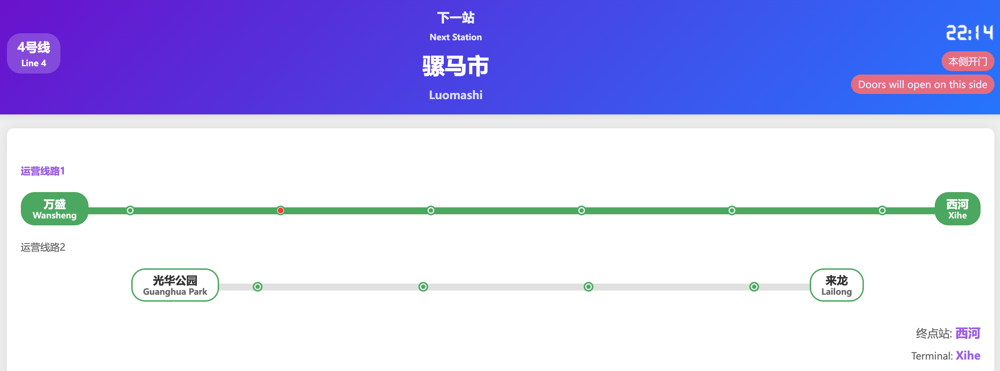
    
  - 反向

    西河往万盛

    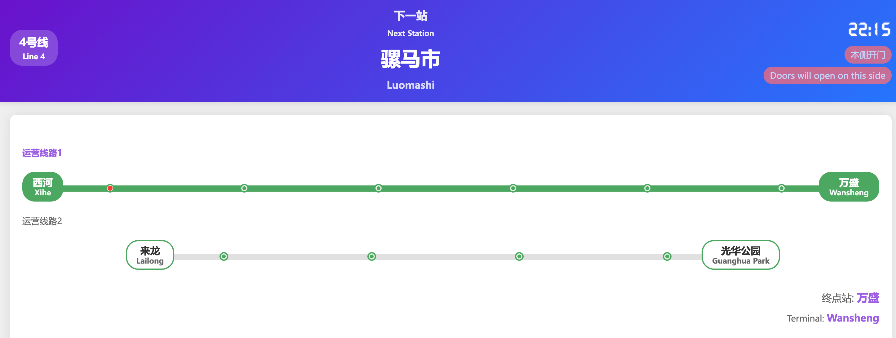

  - 小交路

    光华公园往来龙

    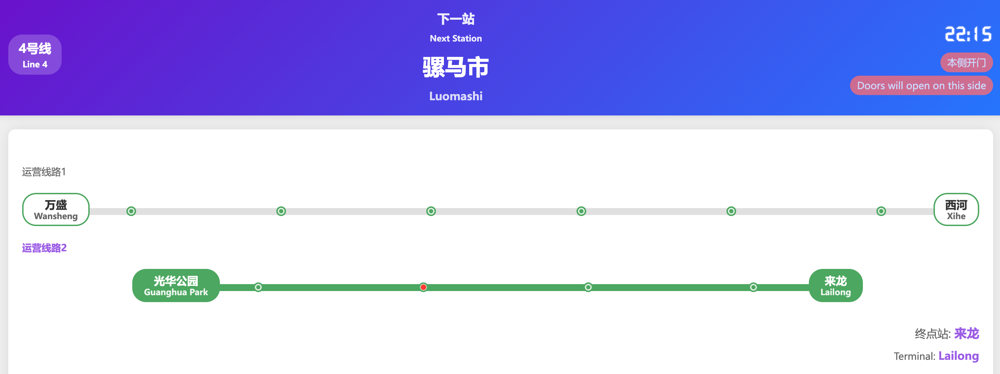

- 环线线路

  - 外环

    

  - 内环

    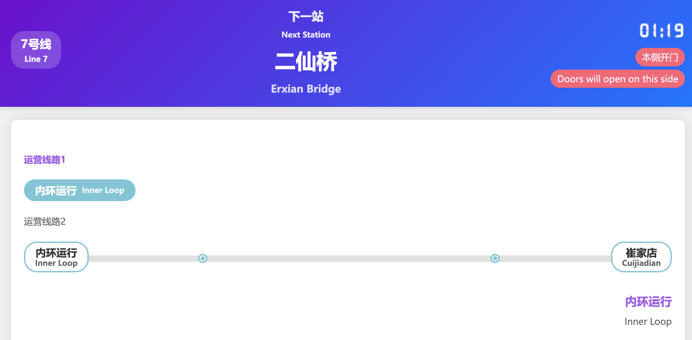


  - 有终点站

    往崔家店

    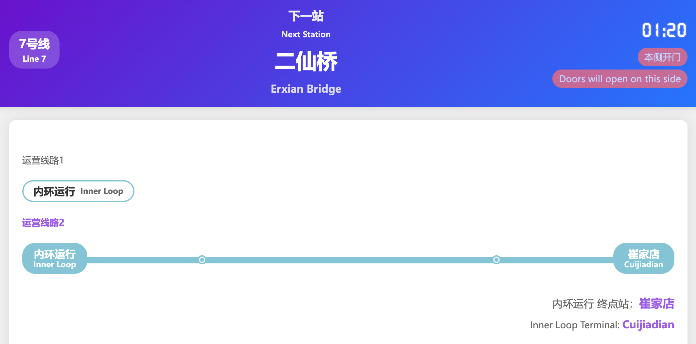


2. 线路图显示

- 普通线路
  - 单行模式 one_line
    > 当行模式下所有站在同一行显示不会换行，适合站数量较少的线路
    > 同时**只有**单行模式支持**分岔路**的显示
    - 普通
      - 大交路

        九江北往高洪

        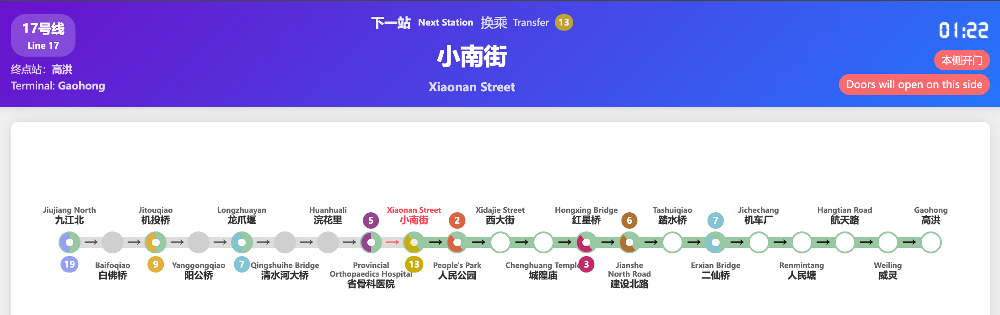

      - 小交路
      
        九江北往机车厂

        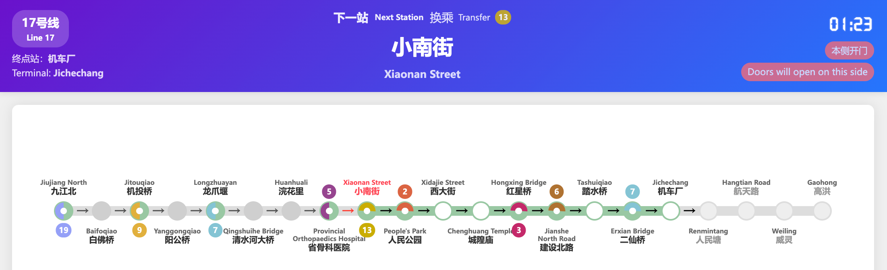
      
    - 分岔路
      > 分叉路在线路配置上与普通交路大致一样，只需单独增加`branch:继承的目标route`字段即可
      - 主路

        韦家碾往科学城
  
        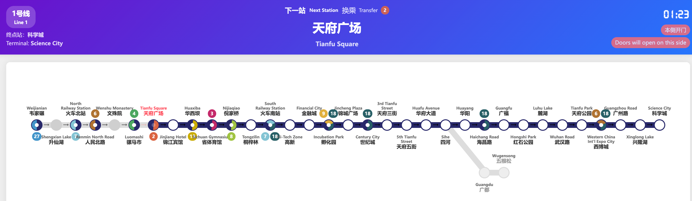
      
      - 岔路

        韦家碾往五根松
        
        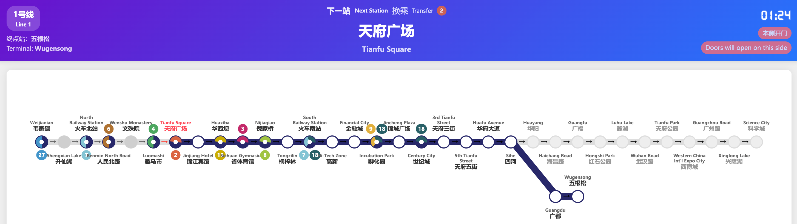

  - 双行模式 two_line
    > 双行模式下所有站平均会在两行显示，适合站数量中等的线路
    > 该模式下**不支持**岔路显示，使用后只会显示主路与岔路其中一条
    - 大交路

      万盛往西河

      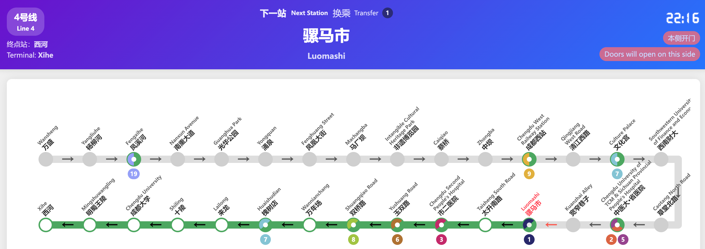
  
    - 小交路

      光华公园往来龙
    
      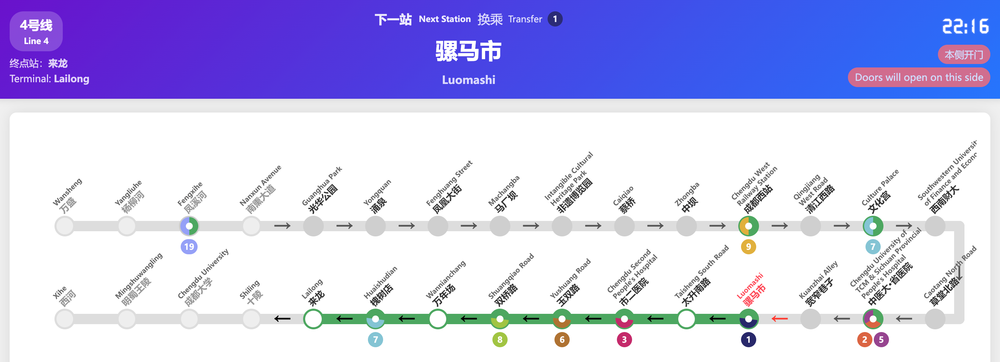
    
  - 自动模式 auto
    > 自动模式下会自动换行，适合站数量较多的线路
    > 该模式下**不支持**岔路显示，使用后只会显示主路与岔路其中一条
    > 自动模式下支持使用字段`station_spacing_multiplier`来调整站间距倍数(>1)，默认值为1.0
    - 大交路

      望丛祠往兰家沟
  
      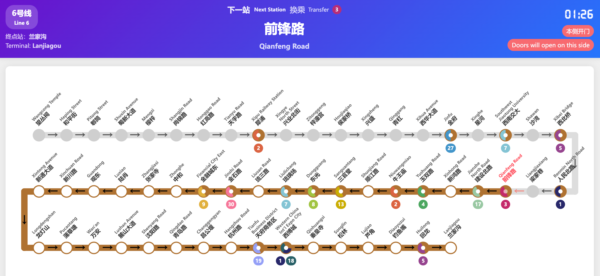
    
    - 小交路

      望丛祠往沈阳路
    
      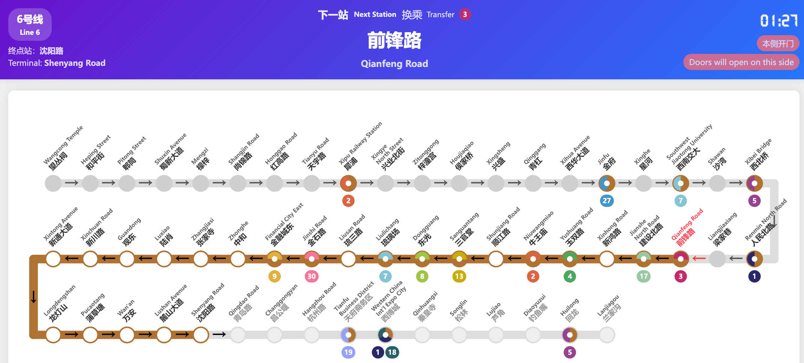
    
  
- 环线线路
  - 自动模式 auto
  
    > 自动模式下会均匀分布在环线的四周
  
    - 全程
  
      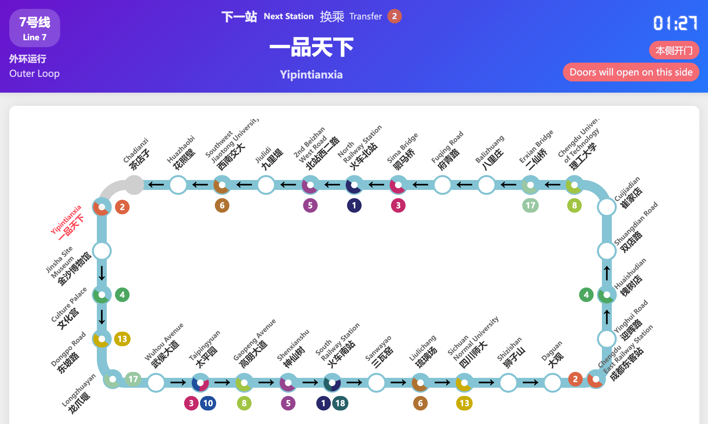

  
    - 有终点站
  
      往崔家店
  
      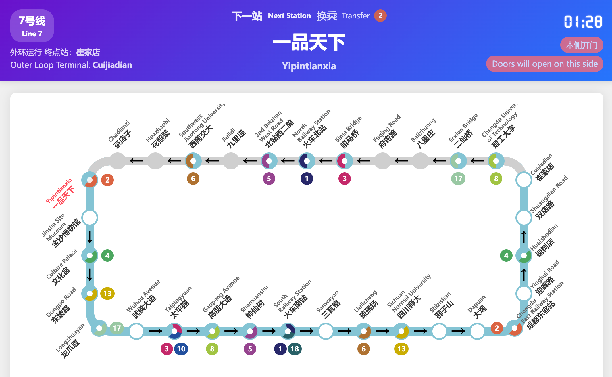
  
  
  - 双行模式 two_line
  
    > 环线双行模式下站点均匀分布在上下两侧
  
    - 全程
  
      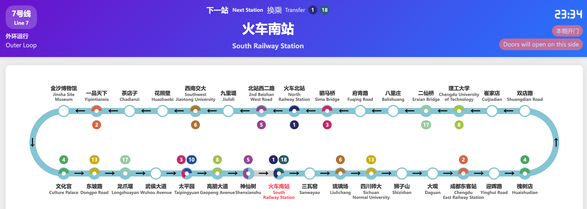
  
    - 有终点站
  
      往崔家店
  
      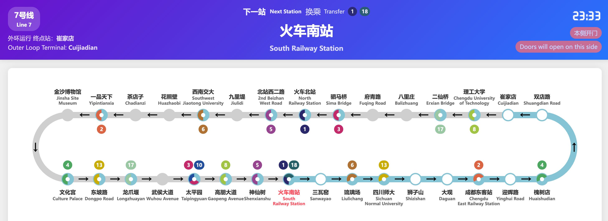
  
  3. 站点详情显示
  
    - 起点
  
      > 起点瓦窑滩左侧不会显示有站点
  
      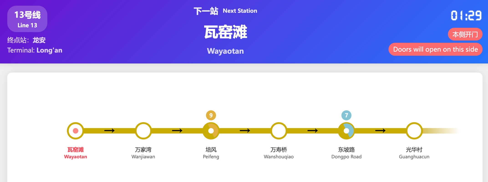
  
  
    - 中间
  
      > 两侧均有站点
  
      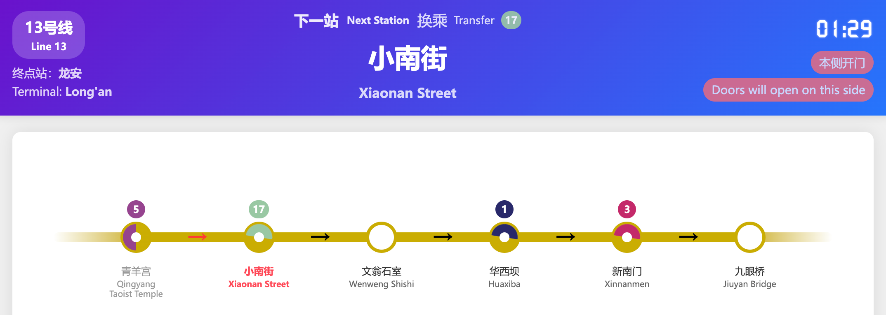
  
  
    - 终点
  
      > 终点站龙安右侧不会显示有站点
  
      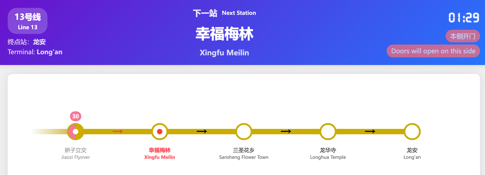
  


​    

## 使用方法

0. 字体下载与名称、站台配置:

- 下载字体文件 [font.ttf](https://wwyq.lanzouo.com/inhZH39s00vc)
- 将字体文件放入`static/fonts/`目录下
- 在data目录下建立你的城市文件夹，示例已经给出了成都地铁线路配置`data/chengdu/`与重庆轨道交通线路配置`data/chongqing/`
- 在项目根目录下`city_config.json`配置你的城市文件夹，示例已经绑定了了成都地铁配置

1. 安装依赖(只需首次使用)：
```bash
pip install -r requirements.txt
```

2. 运行应用：
```bash
python app.py
```

3. 访问系统：
在浏览器中访问 http://localhost:8089

4. 切换站点、线路

**a. 通过按键(推荐)**
- 使用数字键`1`,`2`,`3`分别切换到运营线路页，线路地图页与线路详情页
- 使用小键盘方向左右键切换上下站
- 使用R键切换方向
- 使用`i`,`o`,`p`分别切换单行模式、双行模式与自动模式（环线下按`i`也切换到双行）
- 使用`k`,`l`键切换运营线路
- 使用小键盘方向上下键切换交路

b. 在`current_state.json`下热修改站点信息
对`current_state.json`下的`current_state`变量进行修改
```json
{
    "line_name": "line_1",
    "route_name": "route1",
    "next_station": "韦家碾",
    "direction": 0,
    "door_side": "本侧",
    "current_carriage": 3
}
```
保存后自动动态加载上面的配置，刷新浏览器生效(若修改不符合语法可能导致程序停止，重新执行步骤2即可)

> 注意！若在启动过程中修改了`data/`下的文件，需要终端按下`Ctrl+C`中断原程序，重新执行步骤2才能生效

## 数据说明
- **city_config.json**

决定展示哪个城市的地铁线路，示例已经绑定了成都地铁

- **config.json**

决定标签页显示的名称、年份等信息

- **route.json**：包含各线路的名称、类型和服务信息

字段解释
- line_name: 线路名称
- type: 线路类型，linear为普通线路，loop为环线线路
- layout: 线路布局，auto为自动布局，two_line为双线路布局，one_line为单线路布局，**环线线路不支持one_line布局**
- services
  - type: 交路
  - stations: 站点列表，按顺序排列
  - terminal_station: 终点站，仅环线线路需要配置
  - branch: 继承自哪里的分叉
  - group: 所属组，决定运营路线显示组

普通线路以成都地铁17号线为例：
```json
"line_17": {
  "line_name": "17号线-Line 17",
  "type": "linear",
  "layout": "one_line",
  "station_spacing_multiplier": 1,
  "services": [
    {
      "service_name": "route1",
      "stations": [
        "九江北", "白佛桥", "机投桥", "阳公桥", "龙爪堰", "清水河大桥", "浣花里", "省骨科医院", "小南街", "人民公园", "西大街", "城隍庙", "红星桥", "建设北路", "踏水桥", "二仙桥", "机车厂", "人民塘", "航天路", "威灵", "高洪"
      ]
    },
    {
      "service_name": "route2",
      "stations": [
        "九江北", "白佛桥", "机投桥", "阳公桥", "龙爪堰", "清水河大桥", "浣花里", "省骨科医院", "小南街", "人民公园", "西大街", "城隍庙", "红星桥", "建设北路", "踏水桥", "二仙桥", "机车厂"
      ]
    }
  ]
}
```

普通线路**分叉**以成都地铁1号线为例：
> 注意route2是继承route1的分叉

```json
"line_1": {
  "line_name": "1号线",
  "type": "linear",
  "layout": "auto",
  "services": [
    {
      "type": "route1",
      "stations": [
        "韦家碾", "升仙湖", "火车北站", "人民北路", "文殊院", "骡马市", "天府广场", "锦江宾馆", "华西坝", "省体育馆", "倪家桥", "桐梓林", "火车南站", "高新", "金融城", "孵化园", "锦城广场", "世纪城", "天府三街", "天府五街", "华府大道", "四河", "华阳", "海昌路", "广福", "红石公园", "麓湖", "武汉路", "天府公园", "西博城", "广州路", "兴隆湖", "科学城"
      ]
    },
    {
      "type": "route2",
      "branch": "route1",
      "stations": [
        "韦家碾", "升仙湖", "火车北站", "人民北路", "文殊院", "骡马市", "天府广场", "锦江宾馆", "华西坝", "省体育馆", "倪家桥", "桐梓林", "火车南站", "高新", "金融城", "孵化园", "锦城广场", "世纪城", "天府三街", "天府五街", "华府大道", "四河", "广都", "五根松"
      ]
    }
  ]
}
```

环线线路以成都地铁7号线为例：
```json
"line_7": {
  "line_name": "7号线",
  "type": "loop",
  "layout": "auto",
  "services": [
    {
      "service_name": "route1",
      "terminal_station": "",
      "stations": [
        "火车北站", "北站西二路", "九里堤", "西南交大", "花照壁", "茶店子", "一品天下", "金沙博物馆", "文化宫", "东坡路", "龙爪堰", "武侯大道", "太平园", "高朋大道", "神仙树", "火车南站", "三瓦窑", "琉璃场", "四川师大", "狮子山", "大观", "成都东客站", "迎晖路", "槐树店", "双店路", "崔家店", "理工大学", "二仙桥", "八里庄", "府青路", "驷马桥"
      ]
    },
    {
      "service_name": "route2",
      "terminal_station": "崔家店",
      "stations": [
        "理工大学", "二仙桥", "八里庄", "府青路", "驷马桥", "火车北站", "火车北站", "北站西二路", "九里堤", "西南交大", "花照壁", "茶店子", "一品天下", "金沙博物馆", "文化宫", "东坡路", "龙爪堰", "武侯大道", "太平园", "高朋大道", "神仙树", "火车南站", "三瓦窑", "琉璃场", "四川师大", "狮子山", "大观", "成都东客站", "迎晖路", "槐树店", "双店路", "崔家店"
      ]
    }
  ]
}
```
- **station.json**：包含各站点的索引信息和换乘信息

例如成都地铁火车北站【01/03 07/01】
```json
{
  "火车北站": [
    ["01", "03"],
    ["07", "01"]
  ],
}
```
- **color.json**：包含各线路的颜色信息

配置线路主题色，例如成都地铁：
```json
{
  "line_1": "#28286A",
  "line_7": "#83C4D4",
}
```
- **trans_name.json**：包含各站的英文名称信息

例如成都地铁1号线部分站台，加上`<br>`换行：
```json
{
  "韦家碾": "Weijianian",
  "升仙湖": "Shengxian Lake",
  "火车北站": "North <br>Railway Station"
}
```
