# 轨道交通/地铁PIS车内导视系统

## 项目介绍

本项目基于前后端地铁数据实现一个车内乘客信息系统(PIS)，提供实时的线路信息、到站提醒、站点导航等功能。


## 功能特性

1. **下一站信息显示**：展示当前线路、下一站信息、开门方向等
2. **线路图显示**：展示完整线路图和当前位置
3. **站点详情显示**：展示站点的换乘信息 ~~、预计到达时间等~~
4. ~~**到站信息显示**：到站时的出口指引和站点信息~~

## 效果展示

1. 运营线路与下一站显示

- 普通线路
  - 正向
    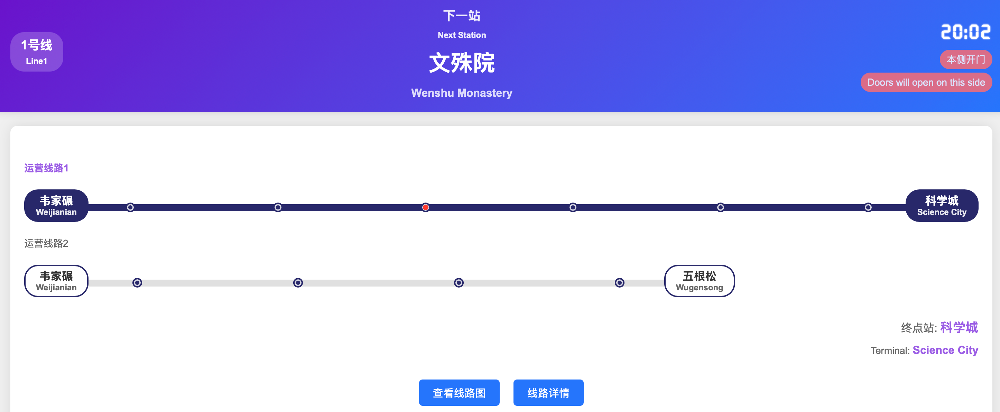
  
  - 反向
  
    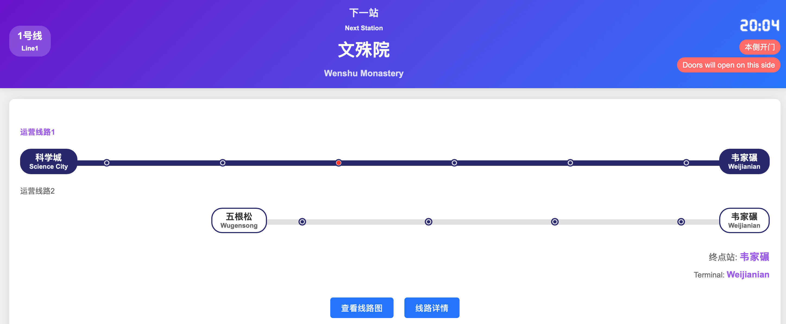
  
  - 小交路
  
    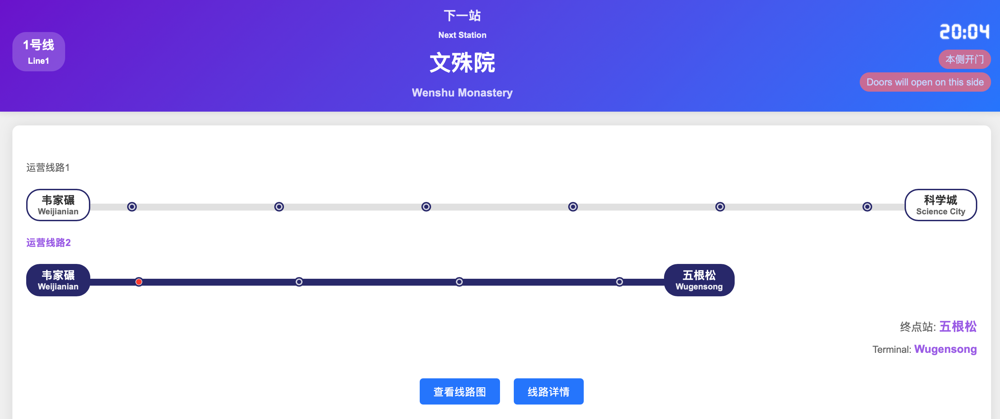

- 环线线路

  - 外环

    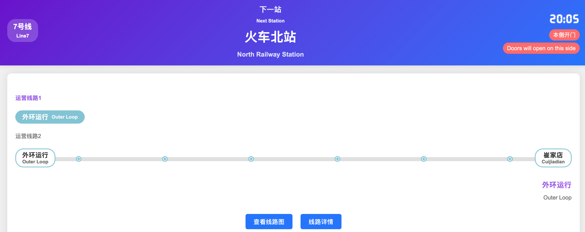

  - 内环

    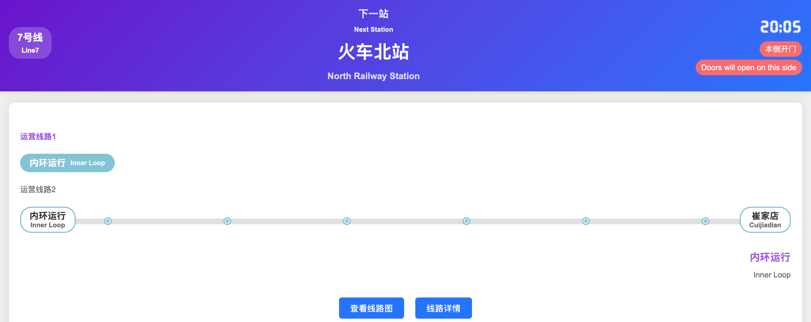

  - 有终点站

    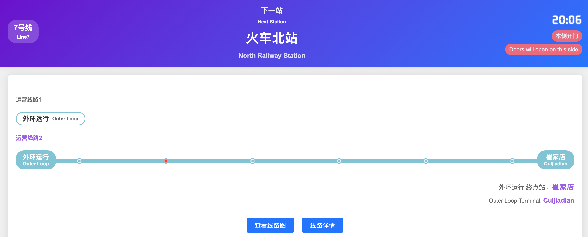

2. 线路图显示

- 普通线路
  - 大交路

    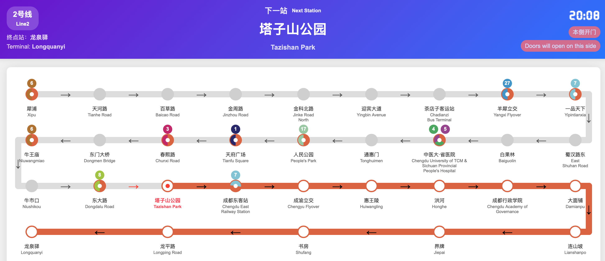

  - 小交路
  
    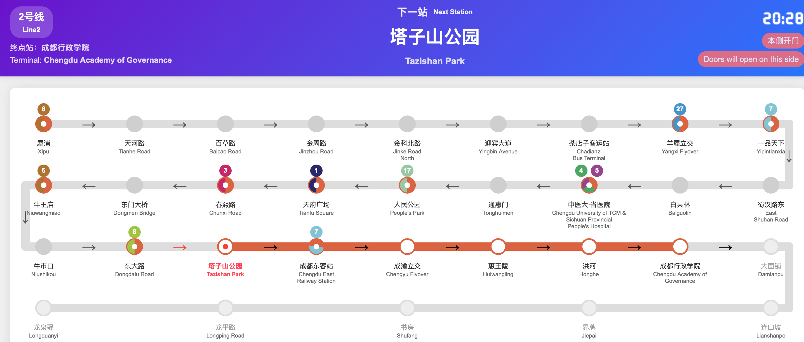
  
- 环线线路
  - 环线

    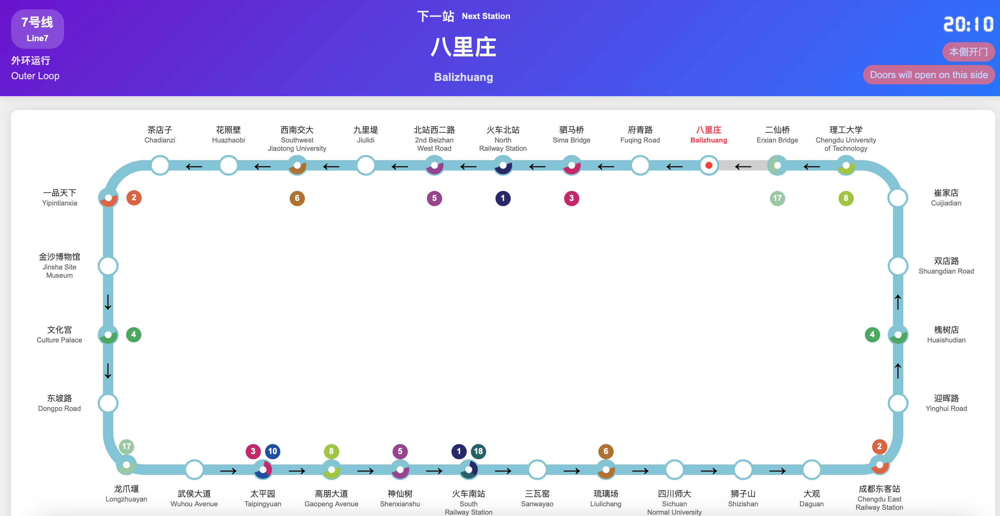
  
  - 有终点站
  
    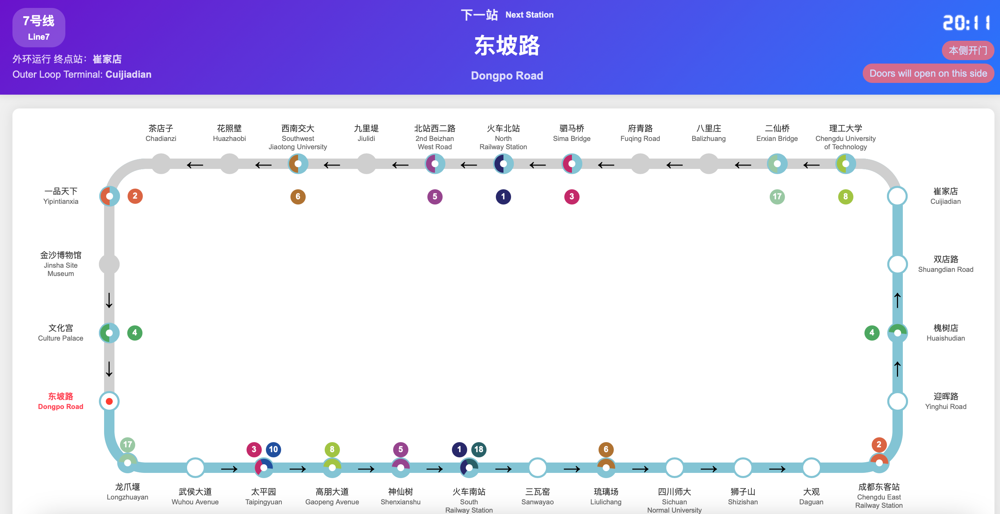

3. 站点详情显示

  - 起点

    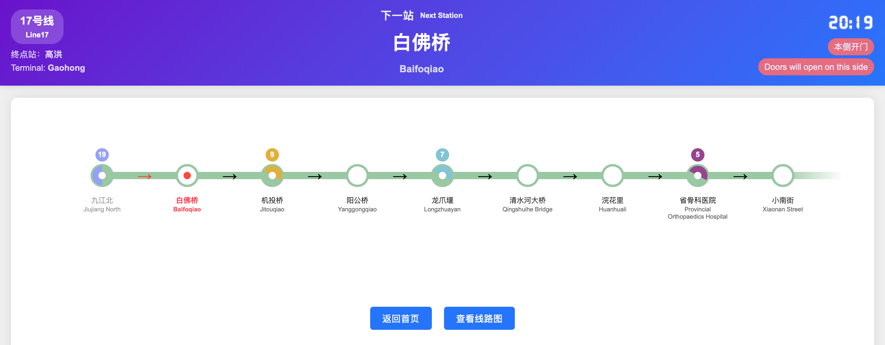

  - 中间

    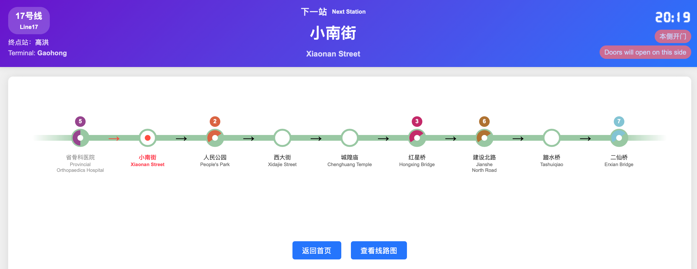

  - 终点

    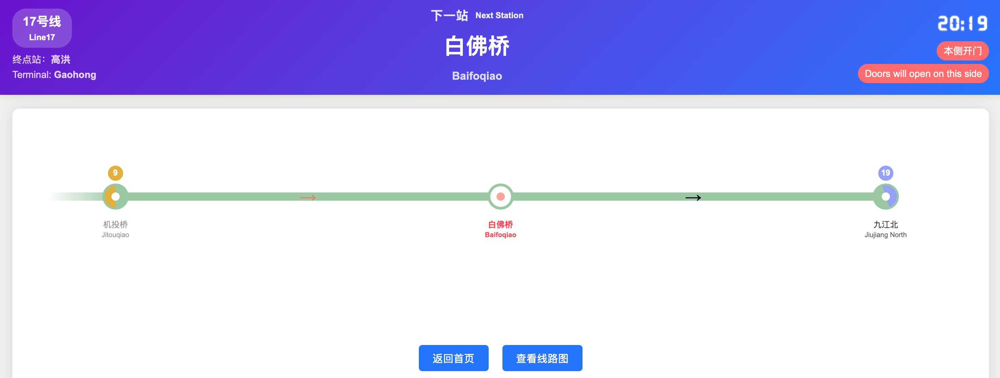

    

## 使用方法

0. 字体下载与名称配置:

- 下载字体文件 [font.ttf](https://wwyq.lanzouo.com/inhZH39s00vc)
- 将字体文件放入`static/fonts/`目录下
- 依据config.json.example配置名称等参数

1. 安装依赖：
```bash
pip install -r requirements.txt
```

2. 运行应用：
```bash
python app.py
```

3. 访问系统：
在浏览器中访问 http://localhost:8089

## 数据说明
- **config/config.json**

依据config.json.example配置文件，系统会根据配置文件加载数据。

- **route.json**：包含各线路的名称、类型和服务信息

普通线路以成都地铁1号线为例：
```json
{
  "line_1": {
    "line_name": "1号线",
    "type": "linear",
    "services": [
      {
        "type": "route1",
        "stations": [
          "韦家碾", "升仙湖", "火车北站", "人民北路", "文殊院", "骡马市", "天府广场", "锦江宾馆", "华西坝", "省体育馆", "倪家桥", "桐梓林", "火车南站", "高新", "金融城", "孵化园", "锦城广场", "世纪城", "天府三街", "天府五街", "华府大道", "四河", "华阳", "海昌路", "广福", "红石公园", "麓湖", "武汉路", "天府公园", "西博城", "广州路", "兴隆湖", "科学城"
        ]
      },
      {
        "type": "route2",
        "stations": [
          "韦家碾", "升仙湖", "火车北站", "人民北路", "文殊院", "骡马市", "天府广场", "锦江宾馆", "华西坝", "省体育馆", "倪家桥", "桐梓林", "火车南站", "高新", "金融城", "孵化园", "锦城广场", "世纪城", "天府三街", "天府五街", "华府大道", "四河", "广都", "五根松"
        ]
      }
    ]
  },
}
```

环线线路以成都地铁7号线为例：
```json
{
  "line_7": {
    "line_name": "7号线",
    "type": "loop",
    "services": [
      {
        "service_name": "route1",
        "terminal_station": "",
        "stations": [
          "火车北站", "北站西二路", "九里堤", "西南交大", "花照壁", "茶店子", "一品天下", "金沙博物馆", "文化宫", "东坡路", "龙爪堰", "武侯大道", "太平园", "高朋大道", "神仙树", "火车南站", "三瓦窑", "琉璃场", "四川师大", "狮子山", "大观", "成都东客站", "迎晖路", "槐树店", "双店路", "崔家店", "理工大学", "二仙桥", "八里庄", "府青路", "驷马桥"
        ]
      },
      {
        "service_name": "route2",
        "terminal_station": "崔家店",
        "stations": [
          "理工大学", "二仙桥", "八里庄", "府青路", "驷马桥", "火车北站", "火车北站", "北站西二路", "九里堤", "西南交大", "花照壁", "茶店子", "一品天下", "金沙博物馆", "文化宫", "东坡路", "龙爪堰", "武侯大道", "太平园", "高朋大道", "神仙树", "火车南站", "三瓦窑", "琉璃场", "四川师大", "狮子山", "大观", "成都东客站", "迎晖路", "槐树店", "双店路", "崔家店"
        ]
      }
    ]
  },
}
```
- **station.json**：包含各站点的索引信息和换乘信息

例如成都地铁火车北站【01/03 07/01】
```json
{
  "火车北站": [
    ["01", "03"],
    ["07", "01"]
  ],
}
```
- **color.json**：包含各线路的颜色信息

配置线路主题色，例如成都地铁：
```json
{
  "line_1": "#28286A",
  "line_7": "#83C4D4",
}
```
- **trans_name.json**：包含各站的英文名称信息

例如成都地铁1号线部分站台，加上`<br>`换行：
```json
{
  "韦家碾": "Weijianian",
  "升仙湖": "Shengxian Lake",
  "火车北站": "North <br>Railway Station"
}
```
