# Rail Transit/Metro PIS In-Carriage Information System

<div align="center">

[](https://creativecommons.org/licenses/by-nc-sa/4.0/) 

[English] | [[简体中文](./README.md)]

</div>

## Declaration

### Summary

It is allowed to view, modify, and use it personally, but commercial use is prohibited, and closing the source is forbidden.

### Formal

The source code of this project is fully open, but it is not a "public domain" asset. The project adopts the **CC BY-NC-SA 4.0** license:
1.  **Non-commercial:** You may not use this project for any commercial profit scenarios.
2.  **No Closed Source:** Any modified versions based on this project must remain open source and use the same license.
3.  **Attribution:** Reposts or citations must retain the original author's attribution.

### Maintenance Mode

This is a personal learning project. To maintain consistency in the codebase and design direction:
*   ❌ **Pull Requests (PRs) are currently not accepted.**
*   If you have good ideas, feel free to discuss them **directly** in Issues to facilitate updates.

### Mirror Address
Mirror address in China Mainland (synchronized every 8 hours): [Gitea Mirror](http://8.130.22.186:53000/DPCau/Open-Metro-PIS)

### Quick Experience
> It is recommended to read the [Keyboard Usage](#usage-by-keyboard) instructions before experiencing.
> It is recommended to use a PC browser for access. Mobile browsers are also adapted with buttons; you can zoom if the width is insufficient.
> This online deployment uses watermarks for anti-theft purposes, but it is **disabled by default** for manual deployment, which can be configured in `global_config.json`.

[Click here](http://8.130.22.186:58089/) to experience the features of this project.

## Update Notes

- 2026-01-02 Added `detail` mode for route preview (for loop lines, express lines, etc.), and added some depot return routes.
- 2025-12-31 Fixed loop line discontinuity issues in the detail page, and filled with passed stations when the number of stations is insufficient
- 2025-12-28 Fixed CRT Direct Express train issues, added Line 4 depot return route
- 2025-12-26 Added Rong Line 2 content, improved branch line detection

<details>
<summary>Click to expand/collapse update history</summary>

- 2025-12-25 Added arrival station page, bound new key operations, fixed loop line issues, added arrival page, added new display mode for detail page, added deployment watermark for anti-theft demo, adapted for mobile.
- 2025-12-24 Added key operation mode, synchronized with overall theme color.
- 2025-12-23 Fixed fork reverse direction issues, added two_line mode for loop lines.
- 2025-12-21 Removed some routes due to temporary closures, replaced README demonstrations.
- 2025-12-11 Completed one_line (including forks), two_line, and auto modes, updated documentation screenshots.
- 2025-12-10 Fixed bug where next station being the terminal on a loop line was identified as the start station.
- 2025-12-09 Fixed discontinuity in loop line detail page, loop line terminals are now strictly based on `terminal_station`.
- 2025-12-07 Updated Line 13 and 30 content.

</details>

## Project Introduction

This project implements an in-carriage Passenger Information System (PIS) based on front-end and back-end metro data, providing real-time line information, arrival reminders, and station navigation.

## Features

1. **Next Station Information**: Displays current line, next station, door opening side, etc.
2. **Line Map Display**: Displays the full line map and current position.
3. **Station Detail Display**: Displays transfer information for stations.
4. **Arrival Station Display**: Displays information about reaching the target station, door opening side, etc.

## Demo

> Screenshots updated on December 25, 2025.

1. Operating Line and Next Station Display

- Normal Line
  - Forward
    
    Wansheng to Xihe
    
    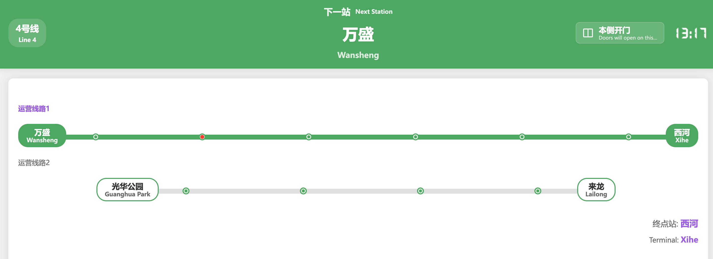
    
  - Reverse
  
    Xihe to Wansheng
    
    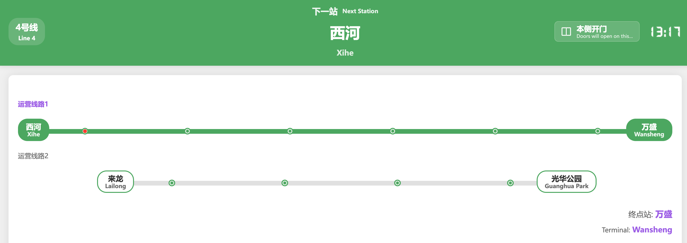

  - Short-turn

    Guanghua Park to Lailong
    
    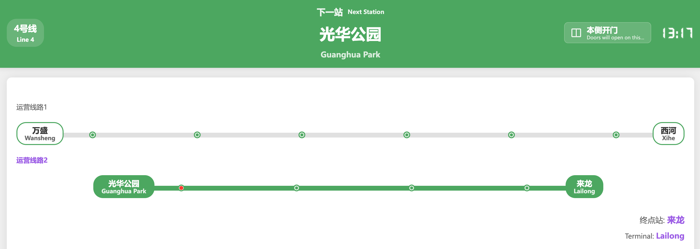


- Loop Line

  - Outer Loop
  
    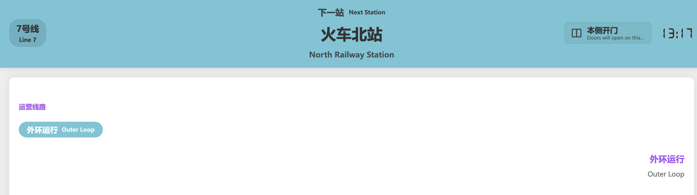
  
  - Detailed Mode
    
    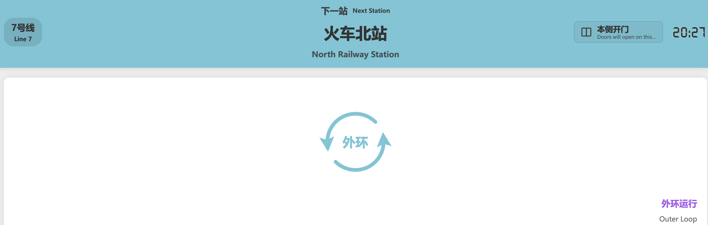
  
  - Inner Loop
  
    - Normal Mode
  
    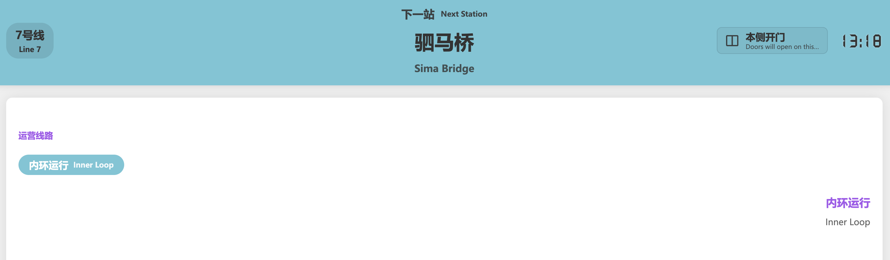
  
    - Detailed Mode

    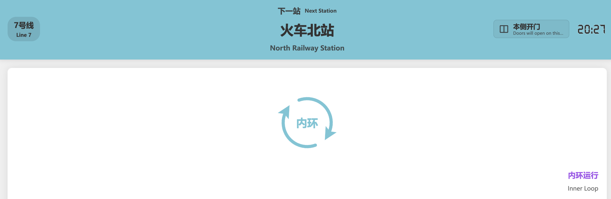
  
  - With Terminal
  
    To Cuijiadian
    
    - Normal Mode

    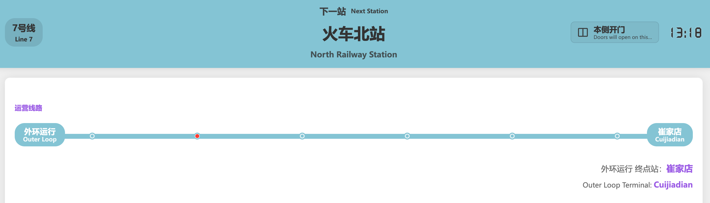

    - Detailed Mode
    
    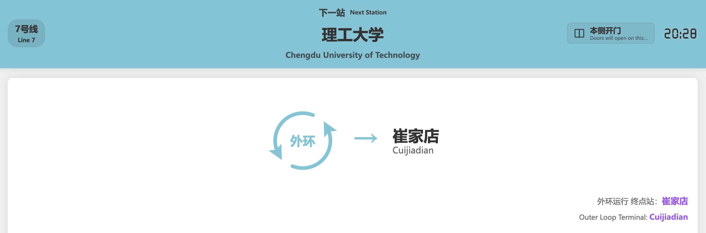

- Lines with Express/Direct Service

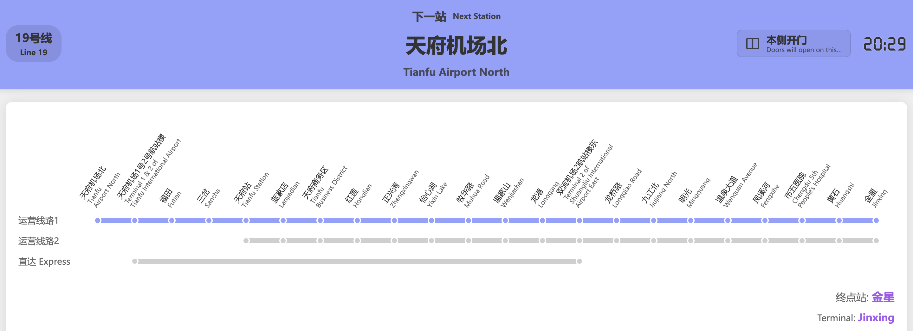

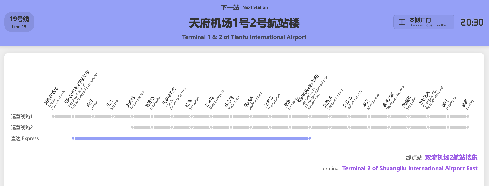


2. Line Map Display

- Normal Line
  - Single-line mode `one_line`
    > All stations are displayed in a single line without wrapping, suitable for lines with fewer stations.
    > Only `one_line` mode supports **branch** display.
    - Normal
      - Full-service

        Jiujiang North to Gaohong

      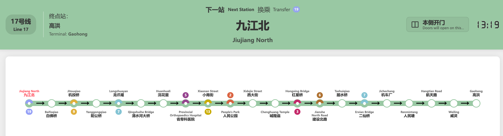
      
      - Short-turn
      
        Jiujiang North to Jichechang

      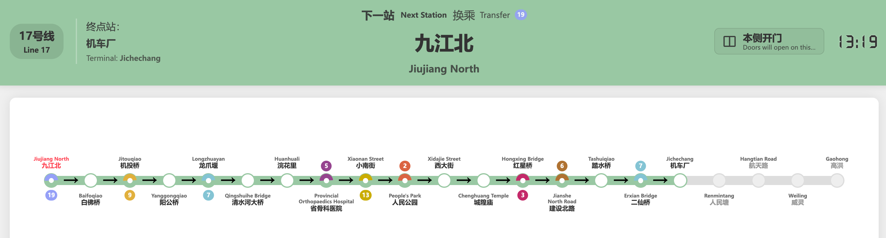

    - Branch

      > Branch routes are configured similarly to normal routes, just add the `branch: target_route_to_inherit` field.

      - Main Route
      Weijianian to Science City
    
      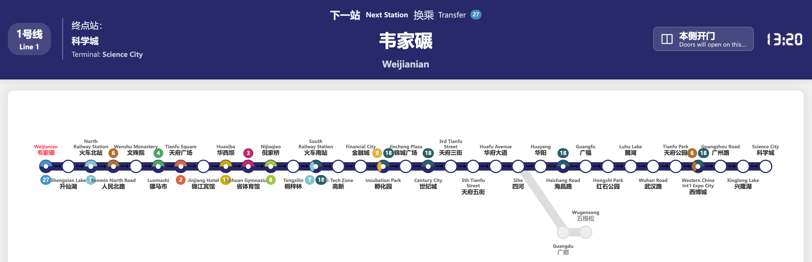

      - Branch  
        Weijianian to Wugensong

      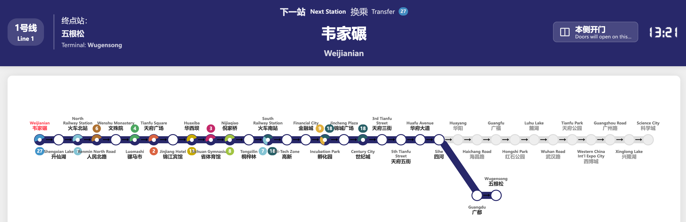


  - Two-line mode `two_line`
    > All stations are evenly distributed across two lines, suitable for lines with a medium number of stations.
    > This mode **does not support** branch display; only one of the routes will be shown.
    - Full-service

      Wansheng to Xihe
    
    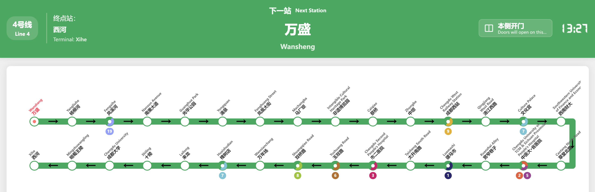
    
    - Short-turn
    
      Guanghua Park to Lailong
    
    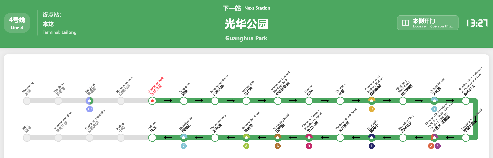    
    
  - Auto mode `auto`
    > Automatically wraps stations, suitable for lines with many stations.
    > This mode **does not support** branch display; only one of the routes will be shown.
    > Supports `station_spacing_multiplier` to adjust spacing (>1), default is 1.0.
    - Full-service

      Wangcong Temple to Lanjiagou
    
    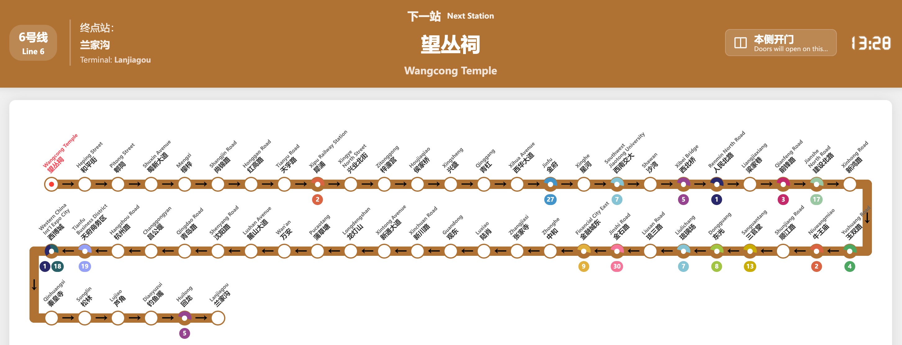
    
    - Short-turn
    
      Wangcong Temple to Shenyang Road
      
    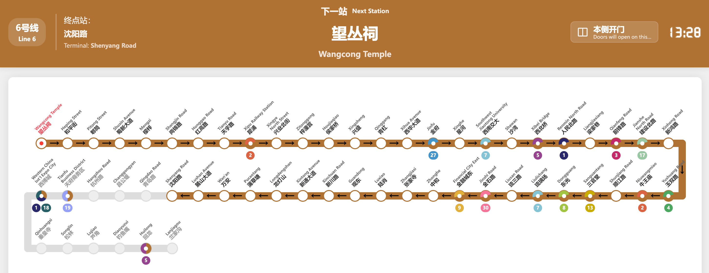
    
    
- Loop Line
  - Two-line mode `two_line`
  
    > Stations are evenly distributed on the top and bottom sides.
  
    - Full-service
    
    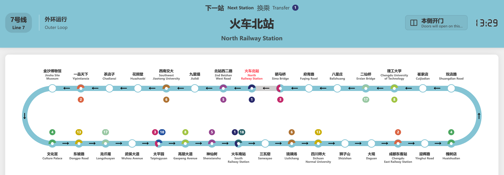
  
    - With Terminal
      To Cuijiadian
  
    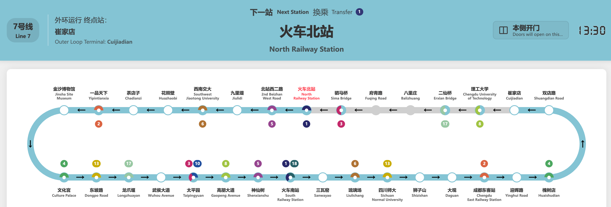
      
  - Auto mode `auto`
  
    > Stations are evenly distributed around the loop.
  
    - Full-service
    
    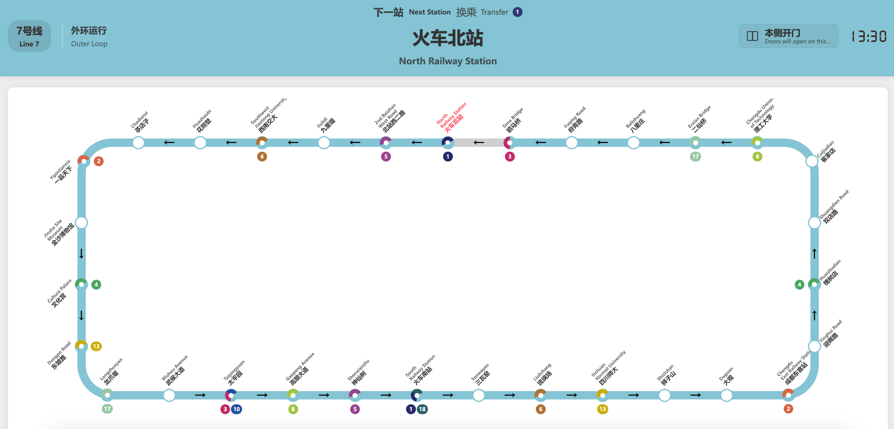

    - With Terminal
  
      To Cuijiadian
  
    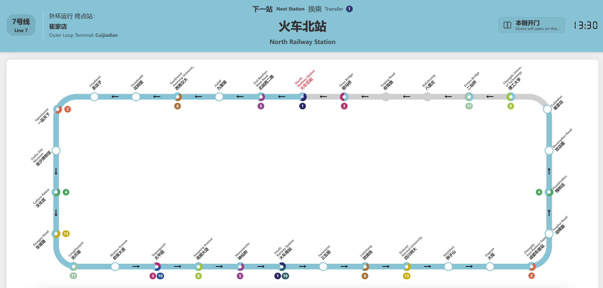
  

3. Station Detail Display

  - Default Mode
  
    - Start
    
      > No station displayed to the left of the starting station Wayaotan.

    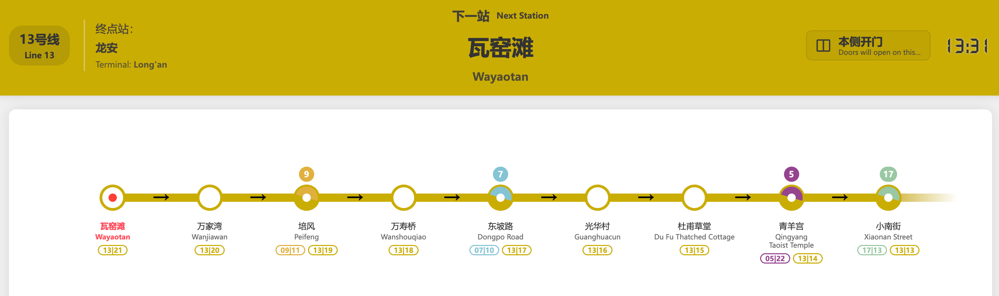
  
    - Middle
    
      > Stations displayed on both sides.

    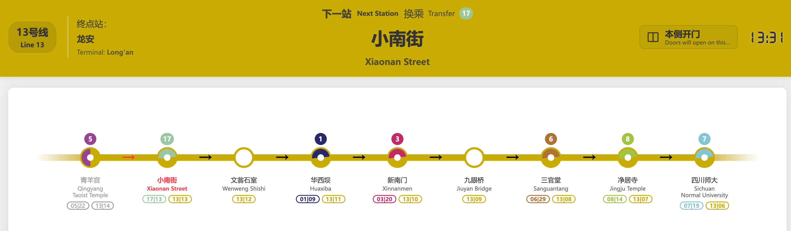

    - Terminal
    
      > No station displayed to the right of the terminal station Long'an.
    
    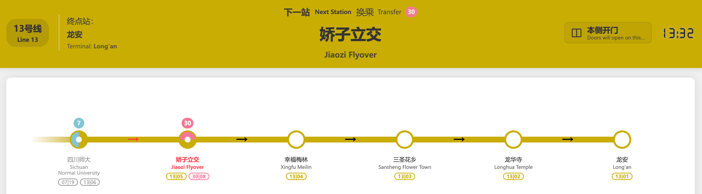
  
  - List Mode
  
    - Start
    
      > No station displayed above the starting station Wansheng.
  
    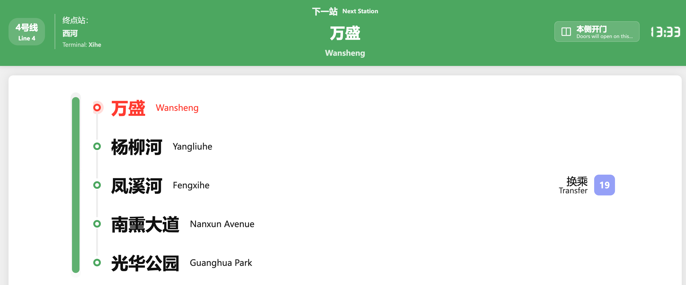
  
    - Middle
    
      > Stations displayed on both sides.
  
    
  
    - Terminal
    
      > No station displayed below the terminal station Xihe.
    
    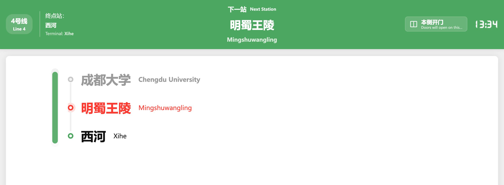

4. Arrival Station Page
  > Displays arrival station info, door opening direction, etc.

  - 6-Carriage Configuration

  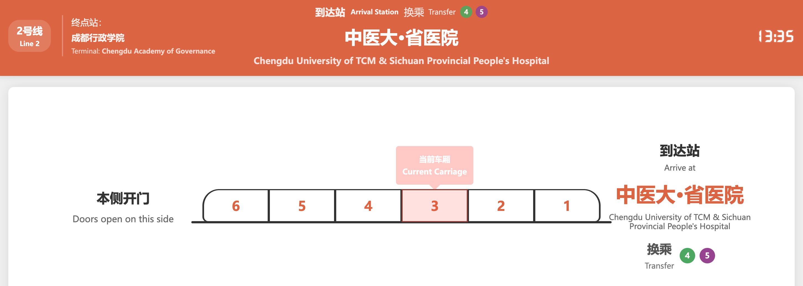

  - 8-Carriage Configuration

  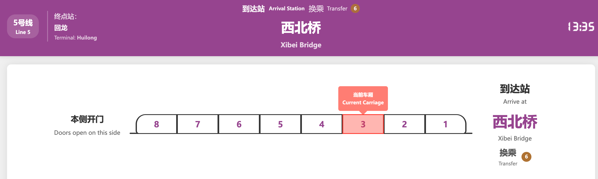

## Usage

0. Font download and configuration:

- Download the font file [font.ttf](https://wwyq.lanzouo.com/inhZH39s00vc)
- Place the font file in the `static/fonts/` directory.
- Create your city folder under the `data` directory. Examples provided include Chengdu Metro `data/chengdu/` and Chongqing Rail Transit `data/chongqing/`.
- Configure your city folder in `city_config.json` at the project root. The example is bound to Chengdu Metro.

1. Install dependencies (first time only):
```bash
pip install -r requirements.txt
```

2. Run the application:
```bash
python app.py
```

3. Access the system:
Visit http://localhost:8089 in your browser.

4. Switch stations and lines

<a id="use-by-keyboard"></a>
**a. Via Keyboard (Recommended)**
- Use number keys `1`, `2`, `3`, `4` to switch between Operating Line page, Line Map page, Station Detail page, and Arrival Station page respectively.
- Use `A` and `D` keys to switch between next/previous stations.
- Use `W` and `S` keys to switch routes.
- Use `F` key to switch to the next station without refreshing the current page (so the next page switch shows the updated station).
- Use `R` key to toggle direction.
- Use `T` key to toggle door opening side.
- On the Line Map page (key `2`), use `I`, `O`, `P` to switch between Single-line, Two-line, and Auto modes (on loop lines, `I` also switches to Two-line).
- On the Station Detail page (key `3`), use `I`, `O` to switch between Default and Column modes.
- Use `K` and `L` keys to switch between operating lines.

b. Hot-modify station info in `current_state.json`
Modify the `current_state` variable in `current_state.json`:
```json
{
    "line_name": "line_1",
    "route_name": "route1",
    "next_station": "韦家碾",
    "direction": 0,
    "door_side": "本侧",
    "current_carriage": 3
}
```
> For English reader only:
> The `door_side` field use `本侧`(this side) and `对侧`(opposite side) to determine the door opening direction.

The configuration will be dynamically loaded after saving. Refresh the browser to apply (syntax errors may stop the program; if so, repeat step 2).

> Note: If you modify files under `data/` while the app is running, you need to press `Ctrl+C` in the terminal and restart step 2.

## Data Description
- **global_config.json**

Determines global configurations, such as watermark and hint visibility.

- **city_config.json**

Determines which city's metro lines to display. The example is bound to Chengdu Metro.

- **config.json**

Determines the displayed names, years, etc., on the tabs.

- **route.json**: Contains line names, types, and service info.

Field Descriptions:
- line_name: Name of the line.
- run_style: Display style for the operating route; `default` for standard mode, `detail` for detailed mode.
- type: Line type; `linear` for normal lines, `loop` for loop lines.
- layout: Line layout; `auto` for automatic, `two_line` for two-line, `one_line` for single-line. **Loop lines do not support `one_line` layout.**
- detail_style: Station detail display style; `default` or `column`.
- carriage_count: Number of carriages, determines the train display on the arrival page.
- services
  - type: Service/Route.
  - stations: Ordered list of stations.
  - label: Service name, displayed on the operating route.
  - terminal_station: Terminal station, only required for loop lines.
  - branch: The route from which this branch inherits.
  - group: The group it belongs to, determining the operating route display.

Example of a normal line (Chengdu Metro Line 17):
```json
"line_17": {
  "line_name": "17号线-Line 17",
  "type": "linear",
  "layout": "one_line",
  "detail_style": "default",
  "carriage_count": 8,
  "station_spacing_multiplier": 1,
  "services": [
    {
      "service_name": "route1",
      "stations": [
        "九江北", "白佛桥", "机投桥", "阳公桥", "龙爪堰", "清水河大桥", "浣花里", "省骨科医院", "小南街", "人民公园", "西大街", "城隍庙", "红星桥", "建设北路", "踏水桥", "二仙桥", "机车厂", "人民塘", "航天路", "威灵", "高洪"
      ]
    },
    {
      "service_name": "route2",
      "stations": [
        "九江北", "白佛桥", "机投桥", "阳公桥", "龙爪堰", "清水河大桥", "浣花里", "省骨科医院", "小南街", "人民公园", "西大街", "城隍庙", "红星桥", "建设北路", "踏水桥", "二仙桥", "机车厂"
      ]
    }
  ]
}
```

Example of a normal line **branch** (Chengdu Metro Line 1):
> Note that route2 is a branch inheriting from route1.

```json
"line_1": {
  "line_name": "1号线",
  "type": "linear",
  "layout": "auto",
  "detail_style": "default",
  "carriage_count": 6,
  "services": [
    {
      "type": "route1",
      "stations": [
        "韦家碾", "升仙湖", "火车北站", "人民北路", "文殊院", "骡马市", "天府广场", "锦江宾馆", "华西坝", "省体育馆", "倪家桥", "桐梓林", "火车南站", "高新", "金融城", "孵化园", "锦城广场", "世纪城", "天府三街", "天府五街", "华府大道", "四河", "华阳", "海昌路", "广福", "红石公园", "麓湖", "武汉路", "天府公园", "西博城", "广州路", "兴隆湖", "科学城"
      ]
    },
    {
      "type": "route2",
      "branch": "route1",
      "stations": [
        "韦家碾", "升仙湖", "火车北站", "人民北路", "文殊院", "骡马市", "天府广场", "锦江宾馆", "华西坝", "省体育馆", "倪家桥", "桐梓林", "火车南站", "高新", "金融城", "孵化园", "锦城广场", "世纪城", "天府三街", "天府五街", "华府大道", "四河", "广都", "五根松"
      ]
    }
  ]
}
```

Example of a loop line (Chengdu Metro Line 7):
```json
"line_7": {
  "line_name": "7号线",
  "type": "loop",
  "layout": "auto",
  "detail_style": "default",
  "carriage_count": 6,
  "services": [
    {
      "service_name": "route1",
      "terminal_station": "",
      "stations": [
        "火车北站", "北站西二路", "九里堤", "西南交大", "花照壁", "茶店子", "一品天下", "金沙博物馆", "文化宫", "东坡路", "龙爪堰", "武侯大道", "太平园", "高朋大道", "神仙树", "火车南站", "三瓦窑", "琉璃场", "四川师大", "狮子山", "大观", "成都东客站", "迎晖路", "槐树店", "双店路", "崔家店", "理工大学", "二仙桥", "八里庄", "府青路", "驷马桥"
      ]
    },
    {
      "service_name": "route2",
      "terminal_station": "崔家店",
      "stations": [
        "理工大学", "二仙桥", "八里庄", "府青路", "驷马桥", "火车北站", "火车北站", "北站西二路", "九里堤", "西南交大", "花照壁", "茶店子", "一品天下", "金沙博物馆", "文化宫", "东坡路", "龙爪堰", "武侯大道", "太平园", "高朋大道", "神仙树", "火车南站", "三瓦窑", "琉璃场", "四川师大", "狮子山", "大观", "成都东客站", "迎晖路", "槐树店", "双店路", "崔家店"
      ]
    }
  ]
}
```
- **station.json**: Contains index and transfer info for each station.

Example: Chengdu Metro North Railway Station [01/03 07/01]
```json
{
  "火车北站": [
    ["01", "03"],
    ["07", "01"]
  ],
}
```
- **color.json**: Contains line color info.

Configure theme colors, e.g., Chengdu Metro:
```json
{
  "line_1": "#28286A",
  "line_7": "#83C4D4",
}
```
- **trans_name.json**: Contains translated names for each station.

Example for Chengdu Metro Line 1 stations, with `<br>` for line breaks:
```json
{
  "韦家碾": "Weijianian",
  "升仙湖": "Shengxian Lake",
  "火车北站": "North <br>Railway Station"
}
```

## License

Distributed under the CC BY-NC-SA 4.0 License. See [CC BY-NC-SA 4.0](https://creativecommons.org/licenses/by-nc-sa/4.0/) for more information.
